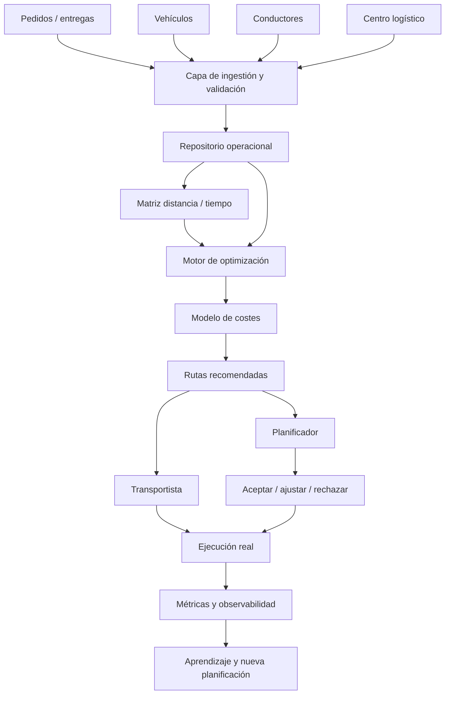
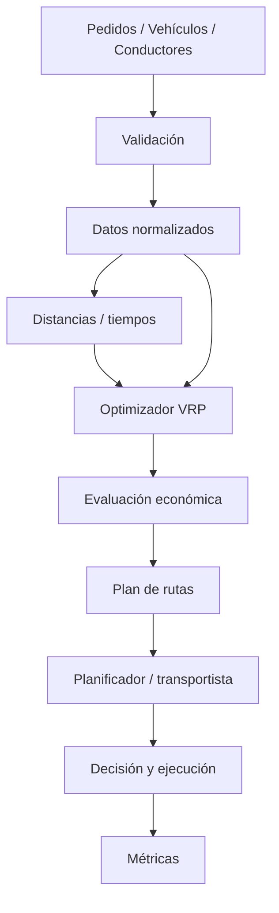

# RUTA-EFICAZ
## Caso práctico de optimización de transporte de mercancías en 10 días

> Material complementario del libro **Arquitectura de eficiencia tecnológica**  
> **El Modelo EFICAZ para diseñar ecosistemas adaptables, seguros y orientados al valor**  
> Autor: Jorge Hernández Chávez

---

## 1. Propósito del repositorio

**RUTA-EFICAZ** es un caso práctico, didáctico y reproducible para aplicar el **Modelo EFICAZ** a un problema realista de logística y transporte: planificar rutas de reparto de mercancías reduciendo distancia, tiempo y coste operativo sin perder de vista las restricciones del negocio.

El repositorio no pretende construir un sistema comercial completo ni sustituir a un TMS. Su objetivo es mostrar cómo pasar de una petición aparentemente técnica —“necesitamos optimizar rutas”— a una **decisión arquitectónica fundamentada, medible y gobernable**.

El lector podrá utilizar este material como:

- laboratorio práctico del Modelo EFICAZ;
- ejemplo de arquitectura aplicada a logística;
- base para un MVP de optimización de rutas;
- ejercicio para aprender a distinguir problema, datos, restricciones, controles, solución y valor;
- punto de partida para evolucionar hacia planificación dinámica, simulación o gemelo digital logístico.

---

## 2. Caso empresarial

La empresa ficticia **TransLog Norte** distribuye mercancía paletizada desde un centro logístico a clientes regionales.

Cada mañana, el equipo de planificación recibe una lista de entregas y asigna manualmente los pedidos a vehículos y conductores. El conocimiento del planificador y de los transportistas es valioso, pero el proceso presenta varios problemas:

- las rutas se construyen manualmente;
- algunos vehículos recorren más kilómetros de los necesarios;
- existen entregas con ventanas horarias;
- la capacidad de los vehículos no siempre se aprovecha bien;
- el tiempo de descarga varía entre destinos;
- se producen horas extra y esperas;
- el consumo de combustible es elevado;
- resulta difícil explicar por qué una ruta fue elegida;
- no existe una comparación sistemática entre ruta planificada, recomendada y realmente ejecutada.

La dirección formula inicialmente la necesidad así:

> “Queremos un sistema que nos diga cuál es la mejor ruta.”

EFICAZ obliga a reformularla:

> **Necesitamos una capacidad de planificación que recomiende combinaciones de rutas viables y económicamente eficientes, respetando las restricciones operativas y permitiendo al planificador conservar el control de la decisión.**

Esta diferencia es esencial. El objetivo no es encontrar “la ruta más corta”. El objetivo es **mejorar el resultado completo de la operación**.

---

## 3. Objetivo del MVP

Construir en diez días un prototipo que:

1. cargue entregas, vehículos, conductores y un centro logístico;
2. valide la calidad mínima de los datos;
3. construya una matriz de distancia/tiempo;
4. resuelva un problema de rutas con múltiples vehículos;
5. respete capacidad y ventanas horarias;
6. estime coste por ruta;
7. compare la planificación actual con la recomendación;
8. permita aceptar o rechazar la recomendación;
9. registre métricas y errores;
10. produzca una decisión final basada en evidencia.

### Resultado esperado

El MVP debe poder responder:

> **¿Qué combinación de rutas permite completar las entregas previstas con un coste operativo razonable y respetando las restricciones principales del servicio?**

---

## 4. Alcance

### Incluido

- un único centro logístico;
- reparto regional;
- flota conocida;
- entregas conocidas al comienzo de la jornada;
- capacidad máxima por vehículo;
- ventanas horarias;
- duración estimada de servicio;
- coste por kilómetro;
- coste por hora;
- comparación entre situación base y propuesta;
- recomendación, no conducción autónoma;
- datos completamente sintéticos.

### Fuera de alcance del MVP

- tráfico en tiempo real;
- reoptimización durante la jornada;
- varios centros logísticos;
- recogidas y entregas simultáneas;
- vehículos eléctricos y recarga;
- conducción autónoma;
- predicción mediante machine learning;
- integración con ERP/TMS real;
- cálculo fiscal o de nómina;
- optimización internacional;
- restricciones legales completas de tacógrafo.

Estos elementos se tratan como **líneas de evolución**, no como requisitos de la primera versión.

---

## 5. El Modelo EFICAZ aplicado

| Fase | Pregunta | Aplicación al caso |
|---|---|---|
| **E — Entender** | ¿Qué problema existe realmente? | Comprender la operación, el proceso manual, las restricciones y el coste actual. |
| **F — Fundamentar** | ¿Qué evidencias sostienen la decisión? | Analizar datos, tiempos, kilómetros, costes, capacidades y calidad. |
| **I — Integrar** | ¿Cómo encaja en el ecosistema? | Conectar pedidos, vehículos, conductores, mapas, planificación y resultado. |
| **C — Controlar** | ¿Qué riesgos, límites y responsabilidades existen? | Validaciones, seguridad, errores, trazabilidad, capacidad de intervención humana. |
| **A — Aplicar** | ¿Cuál es la solución adecuada? | Construir un optimizador mínimo suficiente, no una plataforma sobredimensionada. |
| **Z — Zona de valor / Medir** | ¿Qué valor ha producido? | Comparar coste, tiempo, distancia, puntualidad y utilización antes/después. |

---

## 6. Arquitectura propuesta



### Principio arquitectónico

> **La optimización recomienda; la organización decide.**

En el MVP no se pretende eliminar al planificador ni al transportista. Se busca ofrecer una recomendación explicable que pueda compararse con la experiencia humana.

---

## 7. Datos del proyecto

Los datos incluidos son sintéticos.

### `deliveries.csv`

| Campo | Descripción |
|---|---|
| `delivery_id` | Identificador de entrega |
| `latitude` | Latitud |
| `longitude` | Longitud |
| `weight_kg` | Peso |
| `volume_m3` | Volumen |
| `window_start` | Inicio de ventana |
| `window_end` | Fin de ventana |
| `service_minutes` | Tiempo estimado de descarga |
| `priority` | Prioridad |

### `vehicles.csv`

| Campo | Descripción |
|---|---|
| `vehicle_id` | Identificador |
| `capacity_kg` | Capacidad máxima |
| `capacity_m3` | Volumen máximo |
| `cost_per_km` | Coste aproximado por km |
| `cost_per_hour` | Coste aproximado por hora |
| `start_time` | Inicio de jornada |
| `end_time` | Fin de jornada |

### `drivers.csv`

| Campo | Descripción |
|---|---|
| `driver_id` | Identificador |
| `vehicle_id` | Vehículo asignado |
| `shift_start` | Inicio |
| `shift_end` | Fin |
| `hourly_cost` | Coste horario orientativo |

### `depots.csv`

Define el centro logístico de salida y retorno.

---

## 8. Función objetivo

La primera versión no intenta minimizar únicamente kilómetros.

Una forma simplificada de expresar el coste es:

```text
Coste total =
  coste de distancia
+ coste de tiempo
+ peajes
+ penalización por retraso
+ penalización por incumplimiento
```

Conceptualmente:

```text
Minimizar:
C = α·Distancia + β·Tiempo + γ·Peajes + δ·Retrasos + ε·Incumplimientos
```

Los pesos `α, β, γ, δ, ε` deben ser configurables.

> **“Óptimo” solo tiene significado cuando sabemos qué estamos intentando optimizar.**

---

# 9. Plan de trabajo en 10 días

## Día 1 — E: Entender el problema

### Pregunta del arquitecto

> ¿Estamos intentando reducir kilómetros o mejorar el resultado económico de la operación?

### Actividades

- entrevistar al planificador;
- describir el proceso de planificación;
- identificar restricciones;
- documentar quién decide;
- identificar información disponible;
- registrar problemas observados;
- establecer una línea base.

### Línea base sintética

| Indicador | Situación inicial |
|---|---:|
| Entregas diarias | 80 |
| Vehículos disponibles | 10 |
| Km totales/día | 1.420 |
| Horas conducción+servicio | 96 |
| Entregas fuera de ventana | 7 % |
| Utilización media de capacidad | 63 % |
| Horas de planificación manual | 2,5 h |

### Entregable

`docs/day01_problem.md`

Debe contener: problema, actores, impacto, restricciones, criterios de éxito y elementos fuera de alcance.

### Decisión

No desarrollar todavía ningún algoritmo.

---

## Día 2 — E: Representar la operación actual

### Pregunta del arquitecto

> ¿Cómo funciona realmente la planificación, no cómo creemos que funciona?

### Flujo AS-IS


### Analizar

- pedidos;
- direcciones;
- tiempos de servicio;
- capacidades;
- horarios;
- excepciones;
- conocimiento del conductor;
- restricciones geográficas;
- rutas habituales.

### Dependencias normalmente invisibles

Ejemplos:

1. experiencia del planificador;
2. conocimiento local del conductor;
3. tiempo real de descarga en cada destino.

### Entregable

`docs/day02_as_is.md`

---

## Día 3 — F: Fundamentar con datos

### Pregunta del arquitecto

> ¿Los datos disponibles son suficientemente confiables para optimizar?

### Perfilado mínimo

Analizar:

- coordenadas nulas;
- ventanas inválidas;
- pesos negativos;
- volúmenes imposibles;
- pedidos duplicados;
- tiempos de servicio vacíos;
- vehículos sin capacidad;
- conductores sin vehículo.

### Reglas de calidad

```text
delivery_id      obligatorio y único
latitude         válido
longitude        válido
weight_kg        > 0
window_start     < window_end
service_minutes  >= 0
vehicle capacity > 0
```

### Resultado esperado

Generar `quality_report.csv` con regla, registros revisados, fallos y porcentaje de error.

### Entregable

`docs/day03_data_quality.md`

---

## Día 4 — F: Definir el modelo económico

### Pregunta del arquitecto

> ¿Qué significa realmente “mejor ruta” para esta empresa?

### Costes considerados

- combustible;
- kilometraje;
- mantenimiento;
- conductor;
- tiempo;
- peajes;
- retrasos;
- utilización.

No todos deben implementarse en la primera iteración.

### Ejemplo

```text
Ruta A
110 km
3 h 10 min
Coste estimado: 92 €

Ruta B
98 km
3 h 55 min
Coste estimado: 99 €
```

Aunque B recorra menos kilómetros, A puede ser económicamente mejor.

### Hipótesis

> Si optimizamos conjuntamente distancia, tiempo, capacidad y ventanas, esperamos reducir el coste operativo por entrega sin deteriorar el nivel de servicio.

### Entregable

`docs/day04_cost_model.md`

---

## Día 5 — I: Diseñar la arquitectura objetivo

### Pregunta del arquitecto

> ¿Qué capacidades deben colaborar para producir una recomendación?

### Arquitectura



### Contratos principales

Entrada conceptual:

```json
{
  "delivery_id": "D001",
  "weight_kg": 350,
  "window_start": "09:00",
  "window_end": "11:00"
}
```

Salida conceptual:

```json
{
  "route_id": "R01",
  "vehicle_id": "V01",
  "distance_km": 126.4,
  "estimated_cost": 104.7,
  "stops": ["D005", "D009", "D001"]
}
```

### Entregable

`docs/day05_target_architecture.md`

---

## Día 6 — I + C: Preparar matriz y restricciones

### Pregunta del arquitecto

> ¿Cómo incorporamos la realidad física al modelo matemático?

El solver necesita conocer el coste de desplazarse entre cada par de puntos.

Puede utilizarse:

- distancia euclídea para un laboratorio simple;
- matriz calculada por un motor de rutas;
- datos históricos;
- matriz precalculada.

### Restricciones

- capacidad;
- jornada;
- ventanas horarias;
- duración de servicio;
- punto de inicio/retorno;
- entregas obligatorias.

### Regla importante

Si el optimizador no encuentra una solución viable, debe explicar qué restricción lo impide.

### Entregable

`docs/day06_constraints.md`

---

## Día 7 — C: Controlar riesgos y operación

### Pregunta del arquitecto

> ¿Qué ocurre cuando la recomendación matemática no representa adecuadamente la realidad?

### Riesgos

| Riesgo | Control |
|---|---|
| Dirección incorrecta | Validación geográfica |
| Capacidad errónea | Regla previa al solver |
| Ruta inviable | Validación de restricciones |
| Recomendación costosa | Modelo económico |
| Conocimiento local no modelado | Revisión humana |
| Fallo del optimizador | Plan manual de contingencia |
| Datos incompletos | Registro de errores |

### Observabilidad

Registrar:

```text
run_id
timestamp
deliveries_received
deliveries_planned
vehicles_used
distance_km
estimated_hours
estimated_cost
solver_seconds
status
```

### Responsabilidad

El optimizador recomienda. El planificador aprueba. El conductor puede reportar incidencias.

### Entregable

`docs/day07_controls.md`

---

## Día 8 — A: Construir la solución mínima suficiente

### Pregunta del arquitecto

> ¿Cuál es la menor solución capaz de demostrar valor?

### Stack orientativo

```text
Python
Pandas
OR-Tools
FastAPI (opcional)
PostgreSQL/PostGIS (evolución)
Streamlit (opcional)
```

### Problema matemático inicial

**CVRP + Time Windows**

Vehicle Routing Problem con múltiples vehículos, capacidad y ventanas horarias.

### Salida mínima

```text
RUTA V01
Depot
→ D003
→ D007
→ D011
→ Depot

Distancia: 118 km
Tiempo: 3h 21m
Carga: 76 %
Coste estimado: 97 €
```

### Evitar en este punto

- machine learning;
- microservicios;
- streaming;
- gemelo digital;
- optimización dinámica;
- aplicaciones móviles.

Primero demostrar valor.

### Entregable

`docs/day08_mvp.md`

---

## Día 9 — A + Z: Comparar propuesta y realidad

### Pregunta del arquitecto

> ¿La solución recomendada es realmente mejor que la forma actual de trabajar?

Comparar:

| Métrica | Plan actual | RUTA-EFICAZ |
|---|---:|---:|
| Km | 1.420 | 1.265 |
| Horas | 96 | 88 |
| Vehículos utilizados | 10 | 9 |
| Entregas fuera ventana | 7 % | 2 % |
| Utilización | 63 % | 74 % |

Estos valores son ejemplos educativos.

### Decisión humana

Cada ruta puede clasificarse:

```text
ACCEPTED
MODIFIED
REJECTED
```

Si se modifica o rechaza:

```text
ROAD_RESTRICTION
CUSTOMER_KNOWLEDGE
VEHICLE_ACCESS
DRIVER_EXPERIENCE
OTHER
```

Esta información es muy valiosa para futuras versiones.

### Entregable

`docs/day09_validation.md`

---

## Día 10 — Z: Medir el valor y cerrar el ciclo

### Pregunta del arquitecto

> ¿Qué evidencia demuestra que esta arquitectura merece continuar?

### Ficha de valor

| Dimensión | Antes | Después | Cambio |
|---|---:|---:|---:|
| Km/día | 1.420 | 1.265 | -10,9 % |
| Horas | 96 | 88 | -8,3 % |
| Fuera de ventana | 7 % | 2 % | -5 pp |
| Utilización | 63 % | 74 % | +11 pp |
| Planificación | 2,5 h | 35 min | -76 % |

### Decisión EFICAZ

Seleccionar:

- **mantener**;
- **mejorar**;
- **escalar**;
- **sustituir**;
- **retirar**.

### Resultado esperado

Para el caso didáctico:

> **Mejorar y escalar de forma controlada.**

### Nuevas preguntas

- ¿Necesitamos tráfico real?
- ¿Qué cambia si aparecen pedidos durante la jornada?
- ¿Podemos predecir tiempos de descarga?
- ¿Qué ocurre con vehículos eléctricos?
- ¿Conviene añadir varios depósitos?
- ¿Podemos simular escenarios futuros?

Estas preguntas generan un nuevo ciclo:

```text
Z → nueva evidencia → E
```

---

# 10. Cómo debe usar este repositorio el lector

Existen tres formas recomendadas.

## Nivel 1 — Lectura

Leer el caso después de conocer el Modelo EFICAZ en el libro.

Objetivo: comprender cómo se aplica EFICAZ fuera de un ejemplo puramente conceptual.

## Nivel 2 — Laboratorio

Ejecutar el proyecto utilizando los CSV sintéticos.

Secuencia:

```text
1. revisar datos
2. medir línea base
3. modificar restricciones
4. ejecutar optimización
5. comparar resultados
6. cambiar pesos de coste
7. volver a ejecutar
8. documentar decisiones
```

## Nivel 3 — Adaptación

Sustituir los datos sintéticos por datos propios anonimizados.

Nunca subir información sensible o de clientes reales a un repositorio público.

El lector puede modificar:

- número de vehículos;
- capacidad;
- ventanas;
- pedidos;
- costes;
- prioridades;
- función objetivo.

Y observar cómo cambia la arquitectura y la solución.

---

# 11. Ejercicios para el lector

## Ejercicio 1

Reducir la flota de cuatro a tres vehículos.

> ¿El problema sigue teniendo una solución viable?

## Ejercicio 2

Reducir una ventana horaria y analizar qué entregas comienzan a entrar en conflicto.

## Ejercicio 3

Aumentar el coste por hora del conductor y observar si cambian las rutas.

## Ejercicio 4

Penalizar fuertemente los retrasos y comprobar si el optimizador acepta más kilómetros para mejorar puntualidad.

## Ejercicio 5

Añadir una entrega urgente y comparar plan original frente a plan modificado.

## Ejercicio 6

Crear una ruta manual y compararla con la recomendación.

No preguntar únicamente “¿Cuál recorre menos kilómetros?”. Preguntar:

> **¿Cuál produce mejor resultado global?**

---

# 12. Evolución del proyecto

### Nivel 1 — Planificación estática
Pedidos conocidos al comienzo del día.

### Nivel 2 — Restricciones avanzadas
Tipos de vehículo, compatibilidad, peajes, zonas, descansos y mercancía especial.

### Nivel 3 — Optimización dinámica
Recalcular ante nueva entrega, retraso, avería, incidencia o tráfico.

### Nivel 4 — Predicción
Machine learning para estimar tiempos de servicio, retrasos, demanda, consumo o probabilidad de incidencia.

### Nivel 5 — Simulación

> ¿Qué ocurriría con dos vehículos menos?

> ¿Dónde debería ubicarse un nuevo centro?

> ¿Qué porcentaje de la flota podría ser eléctrica?

### Nivel 6 — Gemelo digital logístico

```text
Operación física
      ↓
telemetría
      ↓
representación digital
      ↓
simulación
      ↓
optimización
      ↓
decisión
      ↓
actuación
      ↓
nueva operación
```

Este nivel conecta directamente con la arquitectura físico-digital explicada en **Arquitectura de eficiencia tecnológica**.

---

# 13. Estructura recomendada del repositorio

```text
ruta-eficaz/
│
├── README.md
├── LICENSE_TEMPLATE.md
├── CONTRIBUTING.md
├── requirements.txt
│
├── data/
│   └── sample/
│       ├── deliveries.csv
│       ├── vehicles.csv
│       ├── drivers.csv
│       └── depots.csv
│
├── docs/
│   ├── 10_day_plan.md
│   ├── day01_problem.md
│   ├── day02_as_is.md
│   ├── day03_data_quality.md
│   ├── day04_cost_model.md
│   ├── day05_target_architecture.md
│   ├── day06_constraints.md
│   ├── day07_controls.md
│   ├── day08_mvp.md
│   ├── day09_validation.md
│   └── day10_value.md
│
└── src/
    └── README.md
```

---

# 14. Instalación futura del laboratorio

Cuando se implemente el código:

```bash
python -m venv .venv
```

Windows:

```bash
.venv\\Scripts\\activate
```

Linux/macOS:

```bash
source .venv/bin/activate
```

Instalar:

```bash
pip install -r requirements.txt
```

El fichero orientativo incluido utiliza:

```text
pandas
ortools
fastapi
uvicorn
streamlit
pydantic
```

No todos son obligatorios para el primer ejercicio.

---

# 15. Cómo crear el repositorio en GitHub

Nombre recomendado:

```text
ruta-eficaz
```

Descripción:

> Caso práctico del Modelo EFICAZ aplicado a optimización de rutas y transporte de mercancías. Material complementario del libro Arquitectura de eficiencia tecnológica.

Pasos:

```bash
git init
git add .
git commit -m "Initial RUTA-EFICAZ case study"
git branch -M main
git remote add origin <URL_DEL_REPOSITORIO>
git push -u origin main
```

### Etiquetas sugeridas

```text
architecture
logistics
transportation
route-optimization
operations-research
vehicle-routing-problem
ortools
eficaz
decision-making
digital-transformation
```

---

# 16. Versionado recomendado

```text
v0.1  caso documental
v0.2  dataset sintético
v0.3  solver básico
v0.4  restricciones y costes
v0.5  dashboard
v1.0  laboratorio completo
```

---

# 17. Licencia

El autor debe decidir la licencia definitiva.

Una opción habitual para código educativo abierto es `MIT License`. Para documentación puede utilizarse una licencia Creative Commons si se desea diferenciarla del código.

> No copies automáticamente una licencia sin comprobar que coincide con tus objetivos de publicación y reutilización.

---

# 18. Aviso educativo

Este proyecto utiliza datos sintéticos y tiene fines educativos.

No debe utilizarse directamente para planificación de seguridad crítica, cumplimiento legal, cálculo laboral, rutas de mercancías peligrosas o decisiones operativas reales sin validación, pruebas, análisis de seguridad y adaptación a la normativa y operación correspondientes.

---

# 19. Relación con el libro

RUTA-EFICAZ complementa el libro:

## **Arquitectura de eficiencia tecnológica**
### **El Modelo EFICAZ para diseñar ecosistemas adaptables, seguros y orientados al valor**

El libro presenta EFICAZ como un modelo para razonar sobre decisiones tecnológicas.

Este repositorio convierte esa idea en un laboratorio:

```text
Entender
   ↓
Fundamentar
   ↓
Integrar
   ↓
Controlar
   ↓
Aplicar
   ↓
Medir
   └────────→ volver a Entender
```

El objetivo del lector no es únicamente conseguir que un algoritmo genere rutas.

El objetivo es comprender por qué existe la solución, qué información necesita, qué restricciones debe respetar, quién responde por ella, cómo sabemos si funciona y cuándo deberíamos modificarla o retirarla.

> **Tecnología con propósito. Arquitectura con criterio.**

---

# 20. Pregunta final para el lector

Cuando el laboratorio termine, no te preguntes únicamente:

> “¿He conseguido una ruta más corta?”

Pregúntate:

> **“¿He diseñado una capacidad logística que produce un resultado mejor, puedo explicar por qué, conozco sus límites y dispongo de evidencia para decidir si merece continuar?”**

Si puedes responder a esas cuatro cuestiones, habrás aplicado EFICAZ.
