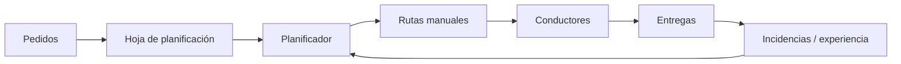
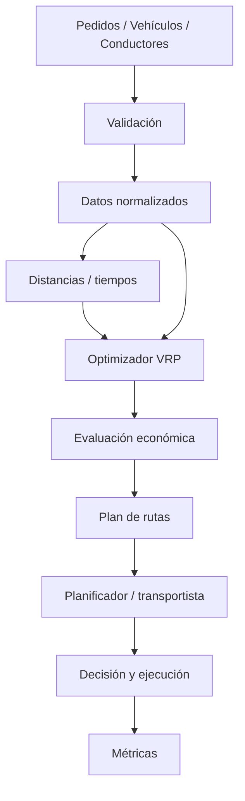

# Guía de trabajo — RUTA-EFICAZ en 10 días

# 9. Plan de trabajo en 10 días

## Día 1 — E: Entender el problema

### Pregunta del arquitecto

> ¿Estamos intentando reducir kilómetros o mejorar el resultado económico de la operación?

### Actividades

- entrevistar al planificador;
- describir el proceso de planificación;
- identificar restricciones;
- documentar quién decide;
- identificar información disponible;
- registrar problemas observados;
- establecer una línea base.

### Línea base sintética

| Indicador | Situación inicial |
|---|---:|
| Entregas diarias | 80 |
| Vehículos disponibles | 10 |
| Km totales/día | 1.420 |
| Horas conducción+servicio | 96 |
| Entregas fuera de ventana | 7 % |
| Utilización media de capacidad | 63 % |
| Horas de planificación manual | 2,5 h |

### Entregable

`docs/day01_problem.md`

Debe contener: problema, actores, impacto, restricciones, criterios de éxito y elementos fuera de alcance.

### Decisión

No desarrollar todavía ningún algoritmo.

---

## Día 2 — E: Representar la operación actual

### Pregunta del arquitecto

> ¿Cómo funciona realmente la planificación, no cómo creemos que funciona?

### Flujo AS-IS



### Analizar

- pedidos;
- direcciones;
- tiempos de servicio;
- capacidades;
- horarios;
- excepciones;
- conocimiento del conductor;
- restricciones geográficas;
- rutas habituales.

### Dependencias normalmente invisibles

Ejemplos:

1. experiencia del planificador;
2. conocimiento local del conductor;
3. tiempo real de descarga en cada destino.

### Entregable

`docs/day02_as_is.md`

---

## Día 3 — F: Fundamentar con datos

### Pregunta del arquitecto

> ¿Los datos disponibles son suficientemente confiables para optimizar?

### Perfilado mínimo

Analizar:

- coordenadas nulas;
- ventanas inválidas;
- pesos negativos;
- volúmenes imposibles;
- pedidos duplicados;
- tiempos de servicio vacíos;
- vehículos sin capacidad;
- conductores sin vehículo.

### Reglas de calidad

```text
delivery_id      obligatorio y único
latitude         válido
longitude        válido
weight_kg        > 0
window_start     < window_end
service_minutes  >= 0
vehicle capacity > 0
```

### Resultado esperado

Generar `quality_report.csv` con regla, registros revisados, fallos y porcentaje de error.

### Entregable

`docs/day03_data_quality.md`

---

## Día 4 — F: Definir el modelo económico

### Pregunta del arquitecto

> ¿Qué significa realmente “mejor ruta” para esta empresa?

### Costes considerados

- combustible;
- kilometraje;
- mantenimiento;
- conductor;
- tiempo;
- peajes;
- retrasos;
- utilización.

No todos deben implementarse en la primera iteración.

### Ejemplo

```text
Ruta A
110 km
3 h 10 min
Coste estimado: 92 €

Ruta B
98 km
3 h 55 min
Coste estimado: 99 €
```

Aunque B recorra menos kilómetros, A puede ser económicamente mejor.

### Hipótesis

> Si optimizamos conjuntamente distancia, tiempo, capacidad y ventanas, esperamos reducir el coste operativo por entrega sin deteriorar el nivel de servicio.

### Entregable

`docs/day04_cost_model.md`

---

## Día 5 — I: Diseñar la arquitectura objetivo

### Pregunta del arquitecto

> ¿Qué capacidades deben colaborar para producir una recomendación?

### Arquitectura



### Contratos principales

Entrada conceptual:

```json
{
  "delivery_id": "D001",
  "weight_kg": 350,
  "window_start": "09:00",
  "window_end": "11:00"
}
```

Salida conceptual:

```json
{
  "route_id": "R01",
  "vehicle_id": "V01",
  "distance_km": 126.4,
  "estimated_cost": 104.7,
  "stops": ["D005", "D009", "D001"]
}
```

### Entregable

`docs/day05_target_architecture.md`

---

## Día 6 — I + C: Preparar matriz y restricciones

### Pregunta del arquitecto

> ¿Cómo incorporamos la realidad física al modelo matemático?

El solver necesita conocer el coste de desplazarse entre cada par de puntos.

Puede utilizarse:

- distancia euclídea para un laboratorio simple;
- matriz calculada por un motor de rutas;
- datos históricos;
- matriz precalculada.

### Restricciones

- capacidad;
- jornada;
- ventanas horarias;
- duración de servicio;
- punto de inicio/retorno;
- entregas obligatorias.

### Regla importante

Si el optimizador no encuentra una solución viable, debe explicar qué restricción lo impide.

### Entregable

`docs/day06_constraints.md`

---

## Día 7 — C: Controlar riesgos y operación

### Pregunta del arquitecto

> ¿Qué ocurre cuando la recomendación matemática no representa adecuadamente la realidad?

### Riesgos

| Riesgo | Control |
|---|---|
| Dirección incorrecta | Validación geográfica |
| Capacidad errónea | Regla previa al solver |
| Ruta inviable | Validación de restricciones |
| Recomendación costosa | Modelo económico |
| Conocimiento local no modelado | Revisión humana |
| Fallo del optimizador | Plan manual de contingencia |
| Datos incompletos | Registro de errores |

### Observabilidad

Registrar:

```text
run_id
timestamp
deliveries_received
deliveries_planned
vehicles_used
distance_km
estimated_hours
estimated_cost
solver_seconds
status
```

### Responsabilidad

El optimizador recomienda. El planificador aprueba. El conductor puede reportar incidencias.

### Entregable

`docs/day07_controls.md`

---

## Día 8 — A: Construir la solución mínima suficiente

### Pregunta del arquitecto

> ¿Cuál es la menor solución capaz de demostrar valor?

### Stack orientativo

```text
Python
Pandas
OR-Tools
FastAPI (opcional)
PostgreSQL/PostGIS (evolución)
Streamlit (opcional)
```

### Problema matemático inicial

**CVRP + Time Windows**

Vehicle Routing Problem con múltiples vehículos, capacidad y ventanas horarias.

### Salida mínima

```text
RUTA V01
Depot
→ D003
→ D007
→ D011
→ Depot

Distancia: 118 km
Tiempo: 3h 21m
Carga: 76 %
Coste estimado: 97 €
```

### Evitar en este punto

- machine learning;
- microservicios;
- streaming;
- gemelo digital;
- optimización dinámica;
- aplicaciones móviles.

Primero demostrar valor.

### Entregable

`docs/day08_mvp.md`

---

## Día 9 — A + Z: Comparar propuesta y realidad

### Pregunta del arquitecto

> ¿La solución recomendada es realmente mejor que la forma actual de trabajar?

Comparar:

| Métrica | Plan actual | RUTA-EFICAZ |
|---|---:|---:|
| Km | 1.420 | 1.265 |
| Horas | 96 | 88 |
| Vehículos utilizados | 10 | 9 |
| Entregas fuera ventana | 7 % | 2 % |
| Utilización | 63 % | 74 % |

Estos valores son ejemplos educativos.

### Decisión humana

Cada ruta puede clasificarse:

```text
ACCEPTED
MODIFIED
REJECTED
```

Si se modifica o rechaza:

```text
ROAD_RESTRICTION
CUSTOMER_KNOWLEDGE
VEHICLE_ACCESS
DRIVER_EXPERIENCE
OTHER
```

Esta información es muy valiosa para futuras versiones.

### Entregable

`docs/day09_validation.md`

---

## Día 10 — Z: Medir el valor y cerrar el ciclo

### Pregunta del arquitecto

> ¿Qué evidencia demuestra que esta arquitectura merece continuar?

### Ficha de valor

| Dimensión | Antes | Después | Cambio |
|---|---:|---:|---:|
| Km/día | 1.420 | 1.265 | -10,9 % |
| Horas | 96 | 88 | -8,3 % |
| Fuera de ventana | 7 % | 2 % | -5 pp |
| Utilización | 63 % | 74 % | +11 pp |
| Planificación | 2,5 h | 35 min | -76 % |

### Decisión EFICAZ

Seleccionar:

- **mantener**;
- **mejorar**;
- **escalar**;
- **sustituir**;
- **retirar**.

### Resultado esperado

Para el caso didáctico:

> **Mejorar y escalar de forma controlada.**

### Nuevas preguntas

- ¿Necesitamos tráfico real?
- ¿Qué cambia si aparecen pedidos durante la jornada?
- ¿Podemos predecir tiempos de descarga?
- ¿Qué ocurre con vehículos eléctricos?
- ¿Conviene añadir varios depósitos?
- ¿Podemos simular escenarios futuros?

Estas preguntas generan un nuevo ciclo:

```text
Z → nueva evidencia → E
```

---

